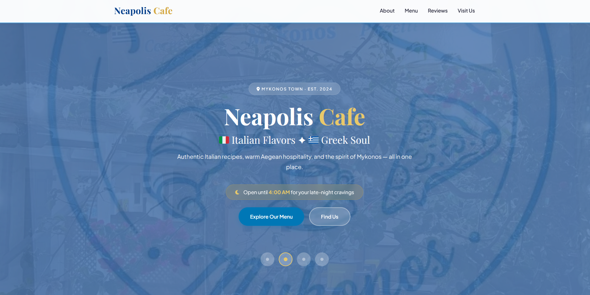

# ☕ Neapolis Cafe — Restaurant Website

A modern, fully responsive single-page website built for Neapolis Cafe in Mykonos Town.

 <!-- Replace with your actual image path or hosting link -->

---

## 📖 About This Project

This is a complete restaurant website solution that I developed from scratch. It demonstrates my ability to create professional, accessible, and high-performance web experiences for hospitality businesses.

The site serves as a digital storefront, featuring the cafe's menu, atmosphere, location, and real customer reviews — all packaged in a clean, modern design.

---

## 🛠️ What I Built

- **Hero slider** — dynamic image rotator for visual storytelling.
- **Interactive menu** — categorized dishes with clickable lightbox previews.
- **Review integration** — Google & TripAdvisor badges with real testimonials.
- **Instagram feed** — dynamic social media content display.
- **Location & hours** — Google Maps integration and opening hours.
- **Mobile-first responsive design** — works flawlessly on all devices.
- **WCAG 2.1 compliant** — accessible navigation, semantic HTML, ARIA labels, and skip links.
- **SEO optimized** — structured data, meta tags, and Open Graph protocol.

---

## 💻 Technical Stack

| Technology | Purpose |
|------------|---------|
| **HTML5** | Semantic structure and accessibility |
| **CSS3** | Custom styling with CSS variables, Flexbox, and Grid |
| **Vanilla JS** | Slider, lightbox, mobile menu, and dynamic feed |
| **Google Fonts** | Typography (*Playfair Display* + *Plus Jakarta Sans*) |
| **Font Awesome** | Vector icons |
| **Schema.org** | Structured data for restaurant local SEO |

---

## 🚀 Getting Started

To run this project locally, follow these simple steps:

1. **Clone the repository:**
   ```bash
   git clone https://github.com
   ```
2. **Navigate to the project folder:**
   ```bash
   cd neapolis-cafe
   ```
3. **Open the project:**
   * Open `index.html` directly in your favorite browser.
   * *Alternatively:* Use the **Live Server** extension in VS Code for hot reloading.

---

## 🧠 What This Shows About Me

- Clean, maintainable code without unnecessary frameworks or heavy dependencies.
- Strong attention to web accessibility (a11y) and user experience.
- solid understanding of modern SEO best practices and structured data.
- Responsive design approach focusing heavily on mobile performance.
- Ability to deliver a complete, production-ready website from scratch.

---

## 🔗 Links

- 🌐 [Live Demo](https://chip-hardware.github.io/neapolis-cafe/)
- 📂 [GitHub Repository](https://github.com)

---

## 📬 Contact

Interested in a similar project or working together? Let's talk!

- **Name:** [Serg]
- **Email:** [druilsenctr@gmail.com]
